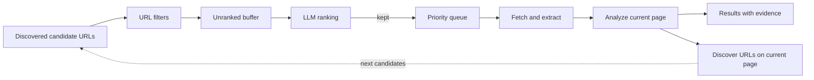

# Crawl me maybe

[](https://github.com/shixuan/crawl-me-maybe/actions/workflows/ci.yml)
[](LICENSE)

> Hey, I just met you,
>
> And this is crazy,
>
> But here's my sources,
>
> So crawl me, maybe?

A goal-driven crawler. You say what you are looking for; it decides where to go, what to skip, and when to stop, inside a budget

## Install

Requires Python 3.10 or later. From this checkout:

```bash
pip install -e .
```

Optional formats and browser support:

```bash
pip install -e '.[rss,browser]'
playwright install chromium
```

Configure the LLM using [`.env.example`](.env.example). Without an API key or base URL, the crawler fetches pages but skips goal enhancement, LLM ranking and analysis.

## Quick start

**Web pages**

```bash
crawl run "recent funding news for AI startups" \
  --seeds "https://news.ycombinator.com,https://techcrunch.com" \
  --max-relevant 40 --page-budget 200
```

**RSS** requires the `rss` extra. Entries supply text and publication dates for ranking.

```bash
crawl run "language features shipped this year, with the version that carries each" \
  --seeds "https://blog.rust-lang.org/feed.xml,https://go.dev/blog/feed.atom" \
  --max-relevant 20
```

**Reddit** uses the `browser` extra. The adapter does not require a saved session.

```bash
crawl run "Toronto events this weekend, with the place and date" \
  --seeds "https://www.reddit.com/r/askTO/" \
  --max-relevant 20 --page-budget 60
```

**Instagram** requires the `browser` extra and a saved login session:

```bash
crawl session ./ig-session.json --feed instagram

crawl run "nearby merchants giving something away, with the shop, offer and deadline" \
  --seeds "seeds.json" \
  --session ig-session.json \
  --max-relevant 40 --page-budget 150 --since "2 weeks"
```

The crawler obeys robots.txt by default. Use `--ignore-robots` to explicitly bypass its rules and crawl delays.

Add `--enhance-seeds` to propose and verify additional sources. Use `--fetcher browser` to render all pages; otherwise fetching is selected per URL.

**Read results** using the task ID printed by the run:

```bash
crawl inspect <task-id> --during "1 week"
crawl inspect <task-id> --export json
python dashboard/serve.py
```

The dashboard serves at `http://127.0.0.1:8765`. Its options are `--port` (default `8765`) and `--results-dir` (default `results`). It supports filtering by classification, dates, text and extracted fields.

## CLI

### `crawl run "<prompt>"`

Name the fields you want in the prompt, such as “shop, offer and deadline”.

| Flag | Default | Meaning |
|---|---|---|
| `--seeds` | none | Comma-separated URLs or a JSON file containing a URL list or `{"seeds": [...], "allowed_domains": [...]}` |
| `--allowed-domains` | none | Comma-separated domain scope; overrides the seeds file |
| `--enhance-seeds` | off | Propose additional sources and fetch them to verify they yield candidates |
| `--depth-limit` | `5` | Maximum candidate depth; seeds start at `0` |
| `--since` | none | Publication cutoff, e.g. `"2 weeks"` or `2026-08-01`; overrides a cutoff inferred from the prompt |
| `--draining` | off | Disable the page limit; other budgets and stop conditions still apply |
| `--fetcher` | per URL | `http` uses HTTP with automatic platform rendering; `browser` renders everything |
| `--session` | none | Playwright storage-state file; enables Instagram and defaults the domain budget to unlimited |
| `--ignore-robots` | off | Bypass robots.txt rules and requested delays |
| `--max-relevant` | `0` | Stop after this many relevant results; `0` means no target; in-flight analysis may overshoot |
| `--page-budget` | `500` | Maximum pages; `0` means unlimited; a positive value conflicts with `--draining` |
| `--token-budget` | `500000` | Shared LLM token budget |
| `--time-budget` | `3600` | Run duration in seconds |
| `--domain-budget` | `50` | Pages per domain; `0` means unlimited |
| `--recall` | off | Keep LLM-rejected candidates at low priority and disable source retirement; URL filters still apply |
| `--analysis` | `on` | `on` or `off`; per-page classification and field extraction |
| `--analyzer-max-chars` | `3000` | Maximum page-text characters sent to the analyzer |
| `--result-dir` | `results` | Parent directory for run output |
| `--log-level` | `INFO` | `DEBUG`, `INFO`, `WARNING`, `ERROR`, `CRITICAL` or `OFF` |

`--max-pages`, `--max-tokens` and `--max-duration` are aliases for the corresponding run budgets. Settings-backed options also accept environment values; CLI flags take precedence. See [Settings](src/crawlme/config.py) for those options.

### `crawl session <path>`

Opens a browser for manual login and saves its session state. Requires a desktop display.

| Flag | Default | Meaning |
|---|---|---|
| `--feed` | `instagram` | Platform to log into |
| `--force` | off | Replace an existing session file |
| `--timeout` | `600` | Login timeout in seconds |

### `crawl inspect <task-id>`

Shows the goal, crawl counts and relevant results grouped by event dates.

| Flag | Default | Meaning |
|---|---|---|
| `--goal` | original goal | Select another stored goal's analyses |
| `--during` | none | Separate events starting beyond this future cutoff, e.g. `"1 week"` or `2026-10-01` |
| `--export` | none | `json` includes extracted fields and evidence; `csv` exports fixed columns |

`--since` concerns **publication time** during crawling. `--during` concerns **event dates** in the results. Results with no date form a separate group; expired results remain visible. The terminal shows a limited number of results per group; export includes all rows.

### `crawl replay <task-id>`

Re-analyzes stored page text without fetching pages. A new prompt also runs goal enhancement. Replay requires a compatible run database.

| Flag | Default | Meaning |
|---|---|---|
| `--prompt` | original prompt | Analyze under another goal |
| `--limit` | all pages | Maximum pages to analyze |
| `--max-tokens` | unlimited | Replay token budget |
| `--analyzer-max-chars` | `3000` | Maximum page-text characters per analysis |
| `--force` | off | Append analyses even when matching ones already exist |
| `--log-level` | `INFO` | Logging level |

## How it works



Each discovered candidate is ranked before its page is fetched and analyzed. The frontier rotates unranked candidates between sources, then fetches kept candidates by priority. Seeds and listing continuation URLs enter the priority queue directly after filtering. Analysis checks field evidence against page text; discovery then supplies the next batch of candidate URLs.

The crawl stops on budgets, a result target, an empty frontier or a reported failure. Individual sources retire after sustained low relevance or old publication dates. Raw pages, analyses, ranking decisions and checkpoints are stored under `results/<timestamp>/`.

See [Architecture](docs/arch.md) for component boundaries and [Changelog](docs/CHANGELOG.md) for releases.

## Configuration and limitations

Copy [`.env.example`](.env.example) to `.env` for credentials, model settings and tuning. Precedence for Settings-backed options is defaults → `.env` → environment → CLI.

- Browser and feed support require their optional dependencies. Automatic dispatch falls back to HTTP with a warning if Playwright is absent.
- Platform adapters depend on site markup and responses, which may change. Login or rate-limit refusals stop the run.
- The analyzer reads a bounded text prefix. Extracted evidence is checked, but relevance and field values remain model judgments.
- Event-date parsing supports explicit English month names and ISO dates; relative phrases such as “tomorrow” are not resolved.

## License

[MIT](LICENSE).
