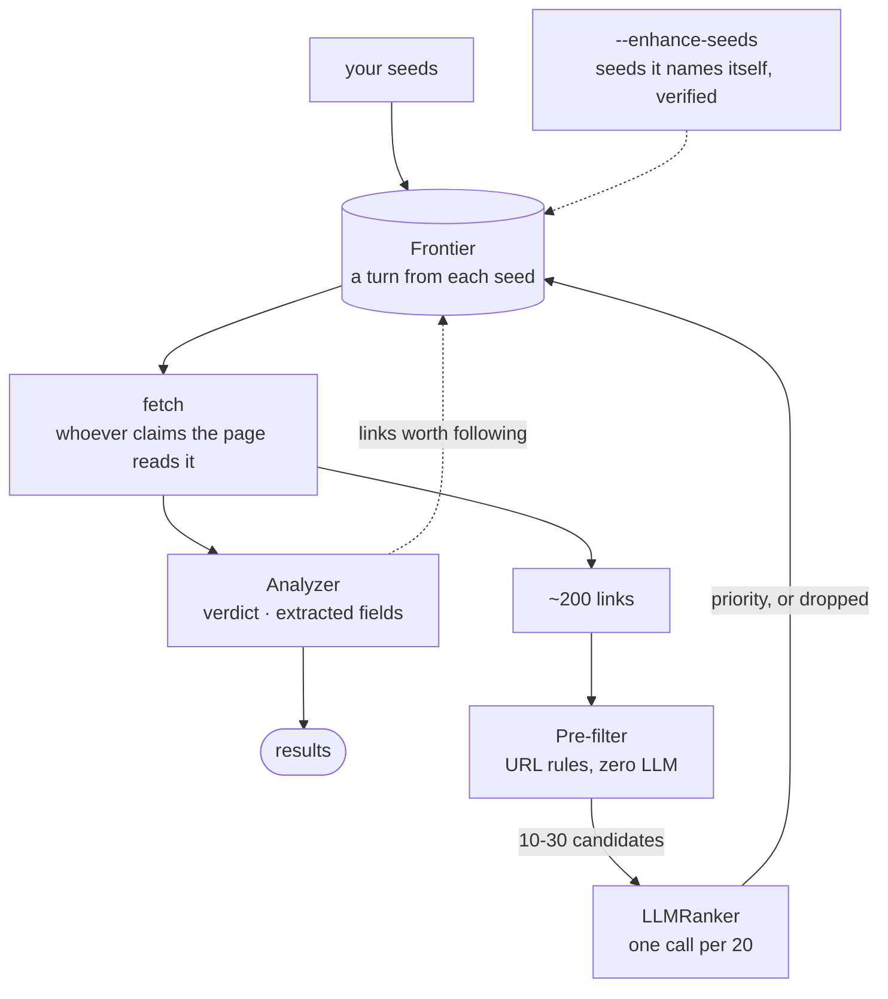

# Crawl me maybe

[](https://github.com/shixuan/crawl-me-maybe/actions/workflows/ci.yml)
[](LICENSE)

> Hey, I just met you,
>
> And this is crazy,
>
> But here's my sources,
>
> So crawl me, maybe?

A goal-driven crawler. You say what you are looking for; it decides where to go, what to skip, and when to stop, inside a budget.

---

## Quick start

```bash
pip install -e .
```

Four kinds of run, one command. What changes is what the seeds point at.

Every example below carries `--ignore-robots`, because without it most of them
fetch nothing. robots.txt is obeyed by default and read from the section
written for this crawler by name, and plenty of sites -- Reddit among them --
tell it not to read them. Whether to go anyway is a decision the flag makes you
state, and it is yours to make.

**A link graph.** Start anywhere, follow links, stop when you have enough.

```bash
crawl run "recent funding news for AI startups" \
  --seeds "https://news.ycombinator.com,https://techcrunch.com" \
  --max-relevant 40 --page-budget 200 --ignore-robots
```

**A feed.** A feed URL is an ordinary seed: it is fetched once, and whichever
adapter recognises the document reads it. An entry is not a bare link -- it
carries the title, the publication time, and usually the post itself -- so the
ranker judges the text before anything else is fetched.

```bash
pip install -e '.[rss]'

crawl run "language features shipped this year, with the version that carries each" \
  --seeds "https://blog.rust-lang.org/feed.xml,https://go.dev/blog/feed.atom" \
  --max-relevant 20 --ignore-robots
```

**A platform that needs a browser but no account.** Reddit builds its pages
with a script, so plain HTTP gets the shell: no posts, no error, nothing to
read. Nothing to pass, though -- the adapter says its pages need rendering, so
those addresses go through a browser and everything else keeps taking the
cheap route. A crawl that mixes the two pays for a browser only on the pages
that need one, and one that never meets a platform never starts one.

Reading Reddit needs no session: a subreddit is open to strangers.

```bash
pip install -e '.[browser]' && playwright install chromium

crawl run "what is worth doing in Toronto this weekend, with the event, the place and the date" \
  --seeds "https://www.reddit.com/r/askTO/" \
  --max-relevant 20 --page-budget 60 --ignore-robots
```

Add `--enhance-seeds` and the model names more sources for the same goal --
other subreddits here, other accounts on a platform, other feeds. Each one is
fetched and read before the crawl uses it: about a third of what it names turns
out not to exist. What survives gets a smaller share of the run than the seeds
you named, and the report at the end says what each was worth.

`--fetcher browser` still exists and still means *everything* through a
browser. A page that is no platform at all can need a script run before it
says anything, and only the person crawling it knows that.

**A login-walled platform.** Log in once by hand; the session file is what
enables the platform adapters, and it also defaults `--domain-budget 0`, since
every candidate on a platform shares one host and a per-domain ceiling would be
a ceiling on the crawl. The platform is read through the browser context holding
the cookies; a site the analyser endorses from there is not, because the
credentials mean nothing to it. How deep to go is left to `--depth-limit`, which
has to cover the way out as well as the platform. Seeds on such a platform without one are refused,
because a logged-out crawl fetches login pages and reports them as an empty
platform.

```bash
pip install -e '.[browser]' && playwright install chromium

crawl session ./ig-session.json --feed instagram

crawl run "nearby merchants giving something away, with the shop, the offer and the deadline" \
  --seeds ./accounts.json \
  --session ./ig-session.json \
  --depth-limit 2 \
  --max-relevant 40 --page-budget 150 \
  --since '2 weeks' --ignore-robots
```

Two, because that is what this goal needs: an account, a post, and the shop's
own site where the deadline is usually written. Leaving it at the default of 5
is not wrong, only more expensive -- past the shop the crawl is on the open web,
where a budget goes quickly.

Then read what it found:

```bash
python dashboard/serve.py
```

| Flag | Values | Default | Meaning |
|------|--------|---------|---------|
| `--port` | int | `8765` | Bound on `127.0.0.1` only |
| `--results-dir` | path | `results` | Where run directories live |

---

## Optional installs

The base install crawls a link graph. Two paths cost more than every user
should carry, so they are extras, and the flags that need them say so before
a run starts rather than failing partway through it.

| Extra | Install | What it buys | Cost |
|-------|---------|--------------|------|
| `rss` | `pip install -e '.[rss]'` | Reading a feed among the seeds; its entries arrive with their own text | feedparser, 0.3MB |
| `browser` | `pip install -e '.[browser]'`<br>then `playwright install chromium` | `--fetcher browser`, `--session`, `crawl session`, and any platform whose pages have to be rendered | 135MB package, ~650MB browser |

Both together: `pip install -e '.[rss,browser]'`.

Without them the crawl still runs; the flags that need them are refused,
naming the flag you typed and the one command that fixes it. A platform met
mid-crawl is the one case that is not refused: it degrades to plain HTTP and
says so, because one unreachable link is not a reason to end a crawl.

---

## CLI

### `crawl run "<prompt>"`

The prompt is the goal, in your own words. Naming the fields you want ("with
the shop, the offer and the deadline") is what makes the analyzer extract them.

**Where to start**

| Flag | Values | Default | Meaning |
|------|--------|---------|---------|
| `--seeds` | comma-separated URLs, or a path | *required in practice* | Where the crawl begins. Anything not starting with `http://` or `https://` is read as a JSON file: a list of URLs, or `{"seeds": [...], "allowed_domains": [...]}` |
| `--allowed-domains` | comma-separated domains | none | Registrable domains the crawl may not leave. Outranks the same key in a seeds file |
| `--enhance-seeds` | flag | off | Let the model name more sources of the same goal, first-hand ones over sites that write about them. Each is fetched, read, and put to the ranker before use, since roughly a third of what it names does not exist and an aggregator yields hundreds of links to its own help centre. They take a smaller share of the crawl than yours, and the run prints what each was worth so you can keep the good ones yourself |

**How far to go**

| Flag | Values | Default | Meaning |
|------|--------|---------|---------|
| `--depth-limit` | int | `5` | Hops from a seed. A listing and its posts are two; a site an analyser endorsed off a post is three |
| `--since` | `"2 weeks"`, `"3 days"`, `2026-08-01` | none | Time window. Candidates a listing dated before it are dropped; with a single seed, the run also stops once content ages out |
| `--draining` | flag | off | Ignore the page budget and stop when the frontier runs dry, which is once every source has retired. Use it when you want everything there is rather than a fixed number. Mutually exclusive with `--page-budget` |

**How to fetch**

| Flag | Values | Default | Meaning |
|------|--------|---------|---------|
| `--fetcher` | `http` \| `browser` | per candidate | Left alone, each address takes the cheaper route its platform allows. `browser` forces one everywhere, for pages that are empty without a script run but belong to no platform |
| `--session` | path | none | A Playwright `storage_state` file. Enables the platform adapters, sends their addresses through the browser context holding it, and defaults `--domain-budget 0` |
| `--ignore-robots` | flag | off | Read the sites robots.txt asks this crawler not to read, and drop the delays it asks for. Reddit is one of them |

**What to spend**

| Flag | Values | Default | Meaning |
|------|--------|---------|---------|
| `--max-relevant` | int | `0` (no target) | Stop once this many pages are judged relevant. The only condition that states a goal rather than a ceiling |
| `--page-budget` | int | `500` | Pages this run may read; `0` means no limit |
| `--token-budget` | int | `500000` | LLM tokens across every stage |
| `--time-budget` | int seconds | `3600` | Wall clock |
| `--domain-budget` | int | `50`, or `0` with `--session` | Pages one registrable domain may contribute; `0` means no ceiling |

**How to judge**

| Flag | Values | Default | Meaning |
|------|--------|---------|---------|
| `--recall` | flag | off | Diagnostic. Nothing the ranker rejects is removed, only ranked last, so a finished run can be asked whether the rejections were right. Not for production: one measured run went from 87% to 37% hit rate |
| `--analysis` | `on` \| `off` | `on` | Per-page analysis: one LLM call per page for a verdict and the goal's fields. `off` disables it |
| `--analyzer-max-chars` | int | `3000` | Page text sent to the analyzer per page |

**Everything else**

| Flag | Values | Default | Meaning |
|------|--------|---------|---------|
| `--result-dir` | path | `results` | Where run directories go |
| `--log-level` | `DEBUG` \| `INFO` \| `WARNING` \| `ERROR` \| `CRITICAL` \| `OFF` | `INFO` | Overrides env `LOG_LEVEL` |

Flags left off fall back to the environment, then to the defaults above.

### `crawl session <path>`

Opens a real browser at the platform, waits while you log in, and saves the
session. Your credentials are typed into the platform's own page and never
reach this process; what lands on disk is the session that login produced.

| Flag | Values | Default | Meaning |
|------|--------|---------|---------|
| `--feed` | `instagram` | the only walled platform | Which platform to open |
| `--force` | flag | off | Replace an existing session file |
| `--timeout` | int seconds | `600` | How long to wait for the login |

A visible browser needs a desktop: WSLg on WSL, an X display over SSH.

### `crawl inspect <task-id>`

Read-only look at a finished run: goals, pages, analyses by classification,
the top relevant pages.

| Flag | Values | Default | Meaning |
|------|--------|---------|---------|
| `--goal` | goal id | the task's own goal | Which goal's analyses to show |
| `--export` | `json` \| `csv` | none | Dump the pages-and-analyses join to stdout. `json` carries the extracted fields and their evidence; `csv` leaves them out, because every goal declares its own fields and there is no stable column set |

### `crawl replay <task-id>`

Re-analyze a finished run's stored pages under a new prompt. No fetching, so
a better prompt costs only the analyzer.

| Flag | Values | Default | Meaning |
|------|--------|---------|---------|
| `--prompt` | string | the original | New goal; its analyses land under a new goal row |
| `--limit` | int | all | Re-analyze at most this many pages |
| `--max-tokens` | int | `500000` | Token budget for the replay |
| `--analyzer-max-chars` | int | `3000` | Page text per analyzer call |
| `--force` | flag | off | Re-analyze pages that already have an identical analysis |
| `--log-level` | as above | `INFO` | |


---

## How it works



**Whoever claims the page reads it.** Instagram answers from the host, RSS from
the document's root element. Nobody claiming is the ordinary case, and the
answer then is to read the links. So one run holds posts, feed entries and
ordinary web pages, and a new platform is one adapter, not a new mode.

**Two ranking stages, and only two.** Two cheap ones scoring keywords and cosine
similarity sat between them, until seven crawls showed neither ever removed a
candidate and neither ordered better than a coin flip. They were removed rather
than tuned; the measurements are on `archive/embedding-investigation`. Without
LLM credentials there is no ranking stage at all, and the crawl fetches in
frontier order.

**Ranking predicts; analysis verifies.** Each extracted value is checked against
the page text before it is stored, and a field the page does not state is simply
absent -- there is no "unknown". The analyzer also names the links worth
following, which is the only way a crawl leaves the platform it started on.

**Fairness upstream of the ranker, priority downstream.** A turn from each seed
keeps one loud account from spending the whole LLM budget. Priority decides only
where the scarce page budget goes.

**Seeds it names itself are checked before use.** About a third of what the
model names does not exist, in a shape a person cannot spot: the brand is real
and the account name is invented. So each proposal has to be fetched, harvested
and put to the ranker before it is used, and one the ranker wants nothing from
is dropped before it costs a page. Nothing is stored -- the run prints what each
turned out to be worth, and keeping one is your call.

**A run says why it stopped.** Budgets, a target met, a drained frontier, plus
`RATE_LIMITED`, `LOGIN_REQUIRED` and `ADAPTER_EMPTY`, which exist because silence
was the bug. "Completed" never stands in for "found nothing and cannot say why".

**A source that stops paying off retires by itself.** Reading past the goal's
window, or a full window of its own pages with almost nothing to show, ends that
source and not the run: a feed is ordered and productive per account and never as
a whole, so counted across accounts neither signal meant anything. Retire them
all and the frontier drains, which is how a run finishes without being told how
many answers to expect.

**Everything is recorded.** Which rule dropped a link, what the ranker scored
it, which model and prompt version produced a judgment, and the sentence each
extracted value came from. Raw HTML is kept, so a better prompt can re-judge a
finished run without re-crawling.

---

## Configuration

Flags say what this run is doing; `.env` says what this machine and account can
do — credentials, endpoints, which model, how much memory to spend. Everything
has a default, so `.env` is optional.

See [`.env.example`](.env.example) for the full list.

---

## Status

| Version | State | What it adds |
|---------|-------|--------------|
| v0.1 | ✅ | Full pipeline at zero LLM cost |
| v0.1.1 | ❌ | (deprecated) EmbeddingRanker, semantic ranking on a local model. (see archive/embedding-investigation branch) |
| v0.2 | ✅ | Goal Enhancer, LLMRanker, per-page analysis, replay, inspect, time horizon |
| v0.3 | ✅ | IG, Playwright with login state, feed traversal, extracted fields with evidence |
| v0.4 | ✅ | Reddit, a fetcher chosen per candidate, paged listings |
| v0.5 | ✅ | Seed enhancement: the model names more sources, each verified before use. A source that stops paying off retires on its own, so a run ends when every one has |

---
