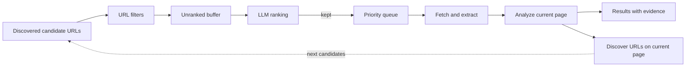

# Crawl me maybe

[](https://github.com/shixuan/crawl-me-maybe/actions/workflows/ci.yml)
[](LICENSE)

> Hey, I just met you,
>
> And this is crazy,
>
> But here's my sources,
>
> So crawl me, maybe?

A goal-driven crawler. You say what you are looking for. It decides where to go, what to skip, and when to stop, within your budget.

## Install

Requires Python 3.10 or later. From this checkout:

```bash
pip install -e .
```

Optional formats and browser support:

```bash
pip install -e '.[rss,browser]'
playwright install chromium
```

Configure the LLM using [`.env.example`](.env.example). Without an API key or base URL, the crawler fetches pages but skips goal enhancement, LLM ranking and analysis.

## Quick start

**Web pages**

```bash
crawl run "recent funding news for AI startups" \
  --seeds "https://news.ycombinator.com,https://techcrunch.com" \
  --max-relevant 40 --page-budget 200
```

**RSS** requires the `rss` extra.

```bash
crawl run "language features shipped this year, with the version that carries each" \
  --seeds "https://blog.rust-lang.org/feed.xml,https://go.dev/blog/feed.atom" \
  --max-relevant 20
```

**Reddit** requires the `browser` extra.

```bash
crawl run "Toronto events this weekend, with the place and date" \
  --seeds "https://www.reddit.com/r/askTO/" \
  --max-relevant 20 --page-budget 60
```

**Instagram** requires the `browser` extra and a saved login session:

```bash
crawl session ./ig-session.json --feed instagram

crawl run "nearby merchants giving something away, with the shop, offer and deadline" \
  --seeds "seeds.json" \
  --session ig-session.json \
  --max-relevant 40 --page-budget 150 --since "2 weeks"
```

**Read results** using the task ID printed by the run:

```bash
crawl inspect <task-id> --during "1 week"
crawl inspect <task-id> --export json
python dashboard/serve.py
```

The dashboard opens at `http://127.0.0.1:8765`. Use `--port` or `--results-dir` to change its port or results directory.

## CLI

### `crawl run "<prompt>"`

Name the fields you want in the prompt, such as “shop, offer and deadline”. Relevant results are grouped automatically. Use `--dedup off` to skip grouping.

| Flag | Default | Meaning |
|---|---|---|
| `--seeds` | none | Comma-separated URLs or a JSON file containing a URL list or `{"seeds": [...], "allowed_domains": [...]}` |
| `--allowed-domains` | none | Comma-separated domain scope overriding the seeds file |
| `--expand-seeds` | off | Propose additional sources and fetch them to verify they yield candidates |
| `--depth-limit` | `5` | Maximum candidate depth, starting at `0` for seeds |
| `--since` | none | Publication cutoff, e.g. `"2 weeks"` or `2026-08-01`, overriding any cutoff inferred from the prompt |
| `--draining` | off | Disable the page limit. Other budgets and stop conditions still apply |
| `--fetcher` | per URL | `http` uses HTTP with automatic platform rendering. `browser` renders everything |
| `--session` | none | Playwright storage-state file enabling Instagram and defaulting the domain budget to unlimited |
| `--ignore-robots` | off | Bypass robots.txt rules and requested delays |
| `--max-relevant` | `0` | Relevant-page target before grouping (`0` disables). In-flight analysis may overshoot |
| `--page-budget` | `500` | Maximum pages (`0` means unlimited). A positive value conflicts with `--draining` |
| `--token-budget` | `500000` | Shared LLM token budget |
| `--time-budget` | `3600` | Run duration in seconds |
| `--domain-budget` | `50` | Pages per domain (`0` means unlimited) |
| `--recall` | off | Keep LLM-rejected candidates at low priority and disable source retirement. URL filters still apply |
| `--analysis` | `on` | Per-page classification and field extraction (`on` or `off`) |
| `--dedup` | `on` | Group equivalent relevant analyses after crawling (`on` or `off`). Requires an LLM |
| `--analyzer-max-chars` | `3000` | Maximum page-text characters sent to the analyzer |
| `--result-dir` | `results` | Parent directory for run output |
| `--log-level` | `INFO` | `DEBUG`, `INFO`, `WARNING`, `ERROR`, `CRITICAL` or `OFF` |

Use `crawl run --help` for all options and aliases.

### `crawl dedup <task-id>`

Group stored results without fetching or re-analyzing pages. Use `--goal` to select a replay goal. Refresh the dashboard after grouping.

```bash
crawl dedup <task-id>
crawl dedup <task-id> --goal <goal-id> --max-tokens 30000
```

Use `--result-dir` to select the results directory and `--log-level` to change logging verbosity.

### `crawl session <path>`

Opens a browser for manual login and saves its session state. Requires a desktop display.

| Flag | Default | Meaning |
|---|---|---|
| `--feed` | `instagram` | Platform to log into |
| `--force` | off | Replace an existing session file |
| `--timeout` | `600` | Login timeout in seconds |

### `crawl inspect <task-id>`

Shows the goal, crawl counts and relevant results grouped by event dates.

| Flag | Default | Meaning |
|---|---|---|
| `--goal` | original goal | Select another stored goal's analyses |
| `--during` | none | Exclude results starting beyond this future cutoff, e.g. `"1 week"` or `2026-10-01` |
| `--export` | none | `json` includes extracted fields and evidence. `csv` exports fixed columns |

`--since` filters publication dates during crawling. `--during` filters event dates in results. Past and undated results remain visible. Topic relevance does not imply an event is still active.

Inspect and the dashboard show the latest analysis for each page. Export includes all latest analyses for the selected goal.

### `crawl replay <task-id>`

Analyzes stored page text without fetching pages. Existing matching analyses are skipped unless `--force` is set.

| Flag | Default | Meaning |
|---|---|---|
| `--prompt` | original prompt | Analyze under another goal |
| `--limit` | all pages | Maximum pages to analyze |
| `--max-tokens` | unlimited | Replay token budget |
| `--analyzer-max-chars` | `3000` | Maximum page-text characters per analysis |
| `--force` | off | Re-analyze pages even when matching analyses exist |
| `--log-level` | `INFO` | Logging level |

## How it works


```mermaid
flowchart LR
    candidates[Discovered candidate URLs] --> filter[URL filters]
    filter --> buffer[Unranked buffer]
    buffer --> rank[LLM ranking]
    rank -->|kept| queue[Priority queue]
    queue --> fetch[Fetch and extract]
    fetch --> analyze[Analyze current page]
    analyze --> results[Results with evidence]
    analyze --> harvest[Discover URLs on current page]
    harvest -. next candidates .-> candidates
```

Results and checkpoints are saved under `results/<timestamp>/`.

See [Architecture](docs/arch.md) for component boundaries and [Changelog](docs/CHANGELOG.md) for releases.

## Configuration and limitations

Copy [`.env.example`](.env.example) to `.env` for credentials and model settings. See [Settings](src/crawlme/config.py) for all options. Precedence is defaults → `.env` → environment → CLI.

- Platform adapters depend on site markup and responses, which may change. Login or rate-limit refusals stop the run.
- The analyzer reads a bounded text prefix. Extracted evidence is checked, but relevance and field values remain model judgments.
- Event-date parsing supports explicit English month names and ISO dates. Relative phrases such as “tomorrow” are not resolved.

## License

[MIT](LICENSE).
