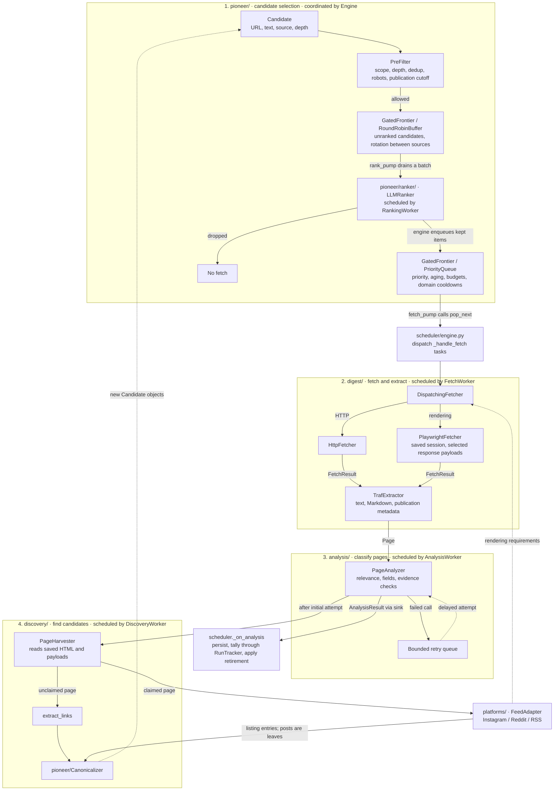
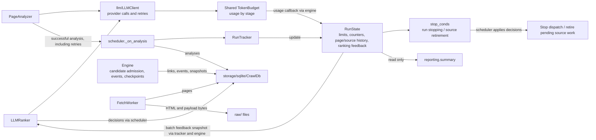

# Architecture

`crawlme` separates discovery, page processing, analysis and scheduling. Shared
Pydantic models live in `schemas/`; `runtime/state.py` holds run-wide data.

## Components



The numbered stages follow one candidate URL. `rank_pump` and `fetch_pump` run
concurrently across different candidates, sharing the frontier's two queues.
`FetchWorker` saves HTML, payloads and the extracted `Page` before analysis.
Harvesting follows the initial analysis attempt and can proceed while a failed
analysis waits for a retry. Analyzer output goes to its sink; discovery reads the
saved page inputs. Dashed arrows show delayed work or candidates for a later pass.

| Location | Responsibility |
|---|---|
| `cli/` | Parse commands, apply settings, build goals, report results |
| `scheduler/factory.py` | Assemble and inject workers and their component dependencies |
| `scheduler/engine.py` | Run pumps, admit candidates, apply outcomes and manage lifecycle |
| `scheduler/workers/` | Execute ranking, fetching, analysis and discovery with stage-specific inputs and outputs |
| `scheduler/reporting.py` | Read RunState to build the CLI report |
| `scheduler/stop_conds.py` | Decide run stopping and individual source retirement |
| `pioneer/` | Canonicalize, filter, buffer and rank candidate URLs; enhance goals and seeds |
| `digest/` | Fetch pages and extract text and metadata |
| `discovery/` | Discover candidates and pagination through adapters or ordinary links |
| `platforms/` | Platform recognition, parsing, rendering and session requirements |
| `analysis/` | Classify pages and extract fields with source evidence |
| `llm/` | Provider calls, retries, JSON parsing and shared token accounting |
| `runtime/tracking.py` | Update RunState, join page verdicts and provide ranking feedback snapshots |
| `runtime/state.py` | Own run limits, counters, page/source history and seed enhancement metadata |
| `runtime/events.py` | Persist crawl events |
| `storage/` | Persistence contract and SQLite implementation |
| `util/dates.py` | Parse event dates and assign result groups |
| `dashboard/` | Local HTTP server and browser UI for stored results |

Workers are concrete classes with different input and output types, not interchangeable
pipeline steps. They neither call one another nor receive the engine or mutable run
state. The engine owns ordering and queue admission; workers use the existing
Fetcher, Extractor, Analyzer, Harvester and Ranker contracts.

The factory creates workers and binds seed enhancement to its dependencies.
`create_scheduler(..., fetcher=stub)` still overrides a component;
`create_scheduler(..., ranking=RankingWorker(ranker))` overrides an assembled worker.

## Crawl lifecycle

1. The CLI applies flags, validates dependencies and session settings, and creates
   a goal, task, scheduler and shared `TokenBudget`.
2. `GoalEnhancer` derives the goal statement, fields and optional publication
   cutoff. An explicit `--since` overrides the inferred cutoff.
3. Optional seed enhancement proposes URLs and verifies that fetched pages yield
   candidates. Accepted proposals receive a smaller share of candidate rotation.
4. Seeds are canonicalized, filtered and queued at priority `1.0`, depth `0`.
5. `fetch_pump` dispatches pages while `rank_pump` scores newly discovered candidates.
6. On exit, the scheduler settles in-flight page tasks, records the task result and
   closes resources. Periodic and pause checkpoints save the frontier; analyzer
   shutdown cancels remaining background retries.

Without LLM configuration, enhancement and analysis are absent and candidates are
queued without LLM ranking. Deterministic URL filtering still runs.

### Fetching and discovery

For a discovered candidate, ranking precedes dispatch, fetching and analysis.
Seeds and listing continuation URLs bypass ranking after filtering. Each dispatched
item is fetched, saved as raw HTML, extracted to a `Page`, and persisted before
analysis. The harvester then reads the saved HTML and payloads to discover new
candidate URLs, which return to the unranked buffer through the pre-filter.

- `DispatchingFetcher` chooses Playwright for enabled adapters that require
  rendering and HTTP otherwise. `--fetcher browser` forces Playwright everywhere.
- Playwright starts lazily, shares a browser context and opens a page per fetch.
  Adapters select response payloads to retain and whether to scroll.
- `TrafExtractor` uses trafilatura for text and Markdown, with BeautifulSoup as a
  fallback. Publication dates come from declared metadata, JSON-LD or time tags.
- `PageHarvester` asks adapters in order. A recognized post is a leaf. A listing
  supplies post candidates and optional pagination. An unclaimed page supplies links.
- Pagination keeps the listing's depth and has a per-listing cap. Discovered posts
  and ordinary links increment depth.
- Pre-filtering applies URL, scope, depth, duplication, robots and publication rules
  before candidates enter the unranked buffer. Seeds bypass some traversal filters.

| Adapter | Recognition and content |
|---|---|
| Instagram | Host-based; requires a session and rendering. Listing payloads provide captions and timestamps, with DOM fallback |
| Reddit | Host and rendered markup; listing cards provide post candidates and pagination |
| RSS/Atom | Document root; entries provide content, links and publication dates; requires `feedparser` |

Adapters parse saved inputs and perform no network requests. Adding a platform
requires implementing `FeedAdapter` and registering it in `platforms/__init__.py`.

The extractor also asks the first URL-matching adapter for page text through
`extract_text(FetchResult)`. Instagram matches the requested post in captured payloads
or inline JSON and merges its caption with distinct carousel captions. Other adapters
return `None`, keeping generic HTML extraction. Missing target text also falls back
to HTML. This reads fetched detail-page data, not `Candidate.text` from ranking.
The selected text is saved in `Page.plain_text` and `markdown`; adapter text records
its platform in `metadata.text_source`. Analysis still applies its character limit.

### Ranking and analysis

`RoundRobinBuffer` rotates candidate batches between seeds. `LLMRanker` uses the
enhanced goal, requested fields, candidate text and previous analysis results.
It splits calls by candidate count and text size. Truncated batches are subdivided;
omitted candidates receive neutral priority. An unrecoverable ranker error stops
the run. `--recall` retains rejected candidates at low priority.

`PageAnalyzer` requests a relevance verdict and, for relevant pages, a summary,
tags and declared fields. Each field contains a value and a verbatim evidence span.
The parser normalizes whitespace and checks evidence against `plain_text`; it does
not independently verify the truth of the value. Unsupported fields are omitted.
Failed analyses enter a bounded retry queue. Successful results reach the scheduler
through a sink, including successes from delayed retries.

`AnalysisWorker` limits initial calls and checks the result target after acquiring
its slot. `PageAnalyzer` continues to own background retries and their shutdown.

Analysis feeds relevant-page summaries back to ranking. It does not nominate links
or bypass the harvester. Platform posts are leaves in the current traversal.

### Event dates

Publication time controls `--since` and source retirement. Event dates describe
what a page announces and affect result grouping only.

The goal's `extraction_spec.time_field` identifies a field and its meaning (`on`
or `until`). Only validated fields produce `starts_on` and `ends_on`. The parser
reads ISO dates and English month names. Explicit years take precedence; omitted
years are resolved near publication, or against the current year when publication
is unknown. Relative phrases are not resolved.

`group_of()` assigns `undated`, `over`, `open` or `later`. An end date before today
is `over`; a start beyond a supplied horizon is `later`. Without a horizon, future
results remain `open`. The dashboard applies its selected horizon in the browser.

## State and concurrency

The scheduler connects stage outputs to shared services. These are coordination
and data dependencies, rather than additional steps in the candidate path above.



The engine exposes `run_state`. `RunState` owns run-wide data:

- `Limits` holds immutable run budgets and goal constraints.
- `Progress` holds counters used by stopping policies.
- `Stats` holds reporting statistics.
- `seeds` holds per-source counters, retirement history and pagination counts.
- `pages`, `page_contexts` and `relevant_pages` hold page associations and ranking feedback.
- Seed enhancement metadata records proposed and rejected sources.

Startup reset clears execution history and counters while preserving prepared seed
URLs, proposal metadata and recorded pre-run token usage. It retains the RunState
object's identity. Resume does not reset it.

`RunTracker` holds only a reference to RunState and updates it synchronously on the
event loop. It returns source keys for the engine to check with `why_retire`; only
the engine removes queued work. Reporting reads RunState directly. Ranking receives
a snapshot of recent relevant pages and the current batch's source contexts, so
later analysis updates affect later batches.

Frontier owns queue internals, Engine owns task handles, and TokenBudget owns token
accounting. These resources are not duplicated in RunState. The single-page path
passes `FrontierItem`, `FetchedPage`, `Page` and `Harvest` between stages; delayed
analysis results join run-wide records by page identity.

`PageBook` joins each page's seed, listing status and analysis verdict. These may
arrive in different orders because analysis can retry. A completed non-listing
record contributes one relevance vote to its seed.

The frontier owns both the scored queue and unranked buffer. Scored work is gated
by domain budgets and cooldowns. Ranking in progress and cooling items count as
remaining work, so an empty immediate pop does not imply a drained frontier.

Fetch and analysis concurrency have separate semaphores. Analysis does not hold a
fetch slot. Dispatch counts in-flight pages against the page budget. The result
target is checked before analysis, but already-running calls may overshoot it.
Blocking extraction runs in worker threads; digest operations using libxml2 share
`LXML_LOCK`. Extraction timeouts bound the await, not the lifetime of a running thread.

## Stopping and checkpoints

`check_stop(task, frontier, limits, progress)` returns all applicable reasons.
Reporting-only counters are not passed to it.

| Reason | Trigger |
|---|---|
| `BUDGET_PAGES`, `BUDGET_TOKENS`, `BUDGET_TIME` | A run budget is exhausted |
| `MAX_RELEVANT` | The relevant-result target is met |
| `FRONTIER_DRAINED` | No queued, buffered, scoring or in-flight work remains |
| `DOMAIN_BUDGET` | A drained run refused candidates at a domain ceiling |
| `USER_REQUESTED` | A stop was requested |
| `RATE_LIMITED`, `LOGIN_REQUIRED` | An adapter reports a run-level refusal |
| `ADAPTER_EMPTY` | A drained run read at least three listings and all yielded no candidates |
| `FATAL` | A component reports an unrecoverable error |

Sources retire independently after fewer than two relevant results in a full
20-page window, or five consecutive dated pages older than `since`. Listings do
not vote on relevance; undated pages neither advance nor reset the age streak.
Retirement removes that seed's pending candidates. `--recall` disables retirement.

The scheduler exposes pause, resume and stop methods. Pause settles in-flight
work and saves a snapshot; resume restores the latest snapshot. The CLI does not
expose a separate resume command.

## Persistence and inspection

Each run has its own directory:

```text
results/<timestamp>/
  db/crawl.db
  raw/<url_key>/<fetch_id>.html
  raw/<url_key>/<fetch_id>.payload.<index>
  log
```

SQLite stores goals, tasks, pages, links, rank decisions, analyses, frontier
snapshots, events, errors and robots cache entries. Writes use an async queue;
reads use the connection directly. Events provide an audit trail. Checkpoints,
rather than event replay, restore the frontier.

`crawl inspect` reads stored results and exports JSON or CSV. The dashboard opens
SQLite read-only and filters loaded results in the browser.

`crawl replay` analyzes stored page text without refetching or re-extracting HTML.
It skips matching `(url_key, goal_id, prompt_version, spec_version, model)` analyses
unless forced. A new prompt creates or reuses its content-derived goal ID. Run
schemas are not migrated across versions.
