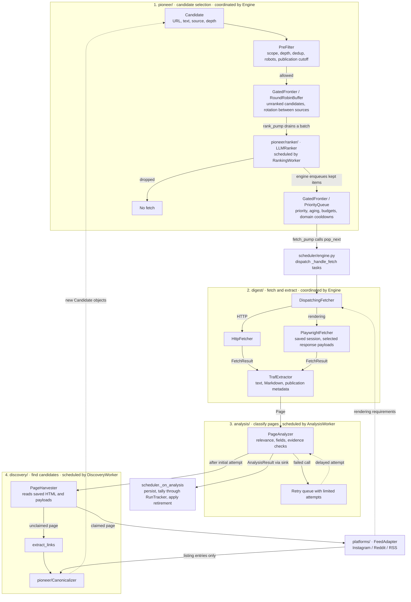
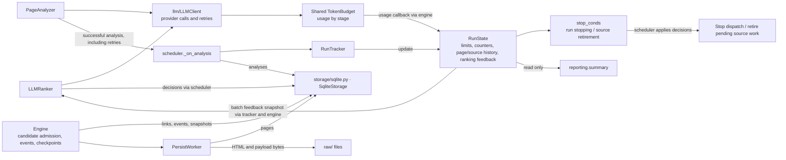

# Architecture

`crawlme` separates discovery, page processing, analysis and scheduling. Shared
Pydantic models live in `schemas/`. Run-wide data lives in `runtime/state.py`.
`prompts.py` holds LLM instructions and input formatting.
Stage modules own model calls, retries and response validation.

## Components


```mermaid
flowchart TB
    subgraph pioneer["1. pioneer/ · candidate selection · coordinated by Engine"]
        candidates["Candidate<br>URL, text, source, depth"] --> filter["PreFilter<br>scope, depth, dedup, robots, publication cutoff"]
        filter -->|allowed| buffer["GatedFrontier / RoundRobinBuffer<br>unranked candidates, rotation between sources"]
        buffer -->|rank_pump drains a batch| ranker["pioneer/ranker/ · LLMRanker<br>scheduled by RankingWorker"]
        ranker -->|engine enqueues kept items| queue["GatedFrontier / PriorityQueue<br>priority, aging, budgets, domain cooldowns"]
        ranker -->|dropped| dropped["No fetch"]
    end

    queue -->|fetch_pump calls pop_next| dispatch["scheduler/engine.py<br>dispatch _handle_fetch tasks"]

    subgraph digest["2. digest/ · fetch and extract · coordinated by Engine"]
        fetcher[DispatchingFetcher] -->|HTTP| http[HttpFetcher]
        fetcher -->|rendering| browser["PlaywrightFetcher<br>saved session, selected response payloads"]
        http -->|FetchResult| extractor["TrafExtractor<br>text, Markdown, publication metadata"]
        browser -->|FetchResult| extractor
    end
    dispatch --> fetcher

    subgraph analysis["3. analysis/ · classify pages · scheduled by AnalysisWorker"]
        analyzer["PageAnalyzer<br>relevance, fields, evidence checks"]
        analyzer -->|failed call| retry["Retry queue with limited attempts"]
        retry -. delayed attempt .-> analyzer
    end
    extractor -->|Page| analyzer
    analyzer -->|AnalysisResult via sink| sink["scheduler._on_analysis<br>persist, tally through RunTracker, apply retirement"]

    subgraph discovery["4. discovery/ · find candidates · scheduled by DiscoveryWorker"]
        harvest["PageHarvester<br>reads saved HTML and payloads"]
        harvest -->|unclaimed page| links[extract_links]
        canonical["pioneer/Canonicalizer"]
        links --> canonical
    end
    adapters["platforms/ · FeedAdapter<br>Instagram / Reddit / RSS"]
    harvest -->|claimed page| adapters
    adapters -->|listing entries only| canonical
    adapters -. rendering requirements .-> fetcher
    analyzer -->|after initial attempt| harvest
    canonical -. new Candidate objects .-> candidates
```

The numbered stages follow one candidate URL. `rank_pump` and `fetch_pump` run
concurrently across different candidates, sharing the frontier's two queues.
`FetchWorker` returns the fetched response. Engine calls `PersistWorker.save_raw`
before invoking Extractor, then `PersistWorker.save_extracted` before analysis.
Harvesting follows the initial analysis attempt and can proceed while a failed
analysis waits for a retry. Analyzer output goes to its sink. Discovery reads the
saved page inputs. Dashed arrows show delayed work or candidates for a later pass.

| Location | Responsibility |
|---|---|
| `cli/` | Parse commands, apply settings, build goals, report results |
| `scheduler/factory.py` | Assemble and inject workers and their component dependencies |
| `scheduler/engine.py` | Run pumps, admit candidates, apply outcomes and manage lifecycle |
| `scheduler/workers/` | Execute ranking, fetching, persistence, analysis and discovery |
| `scheduler/reporting.py` | Read RunState to build the CLI report |
| `scheduler/stop_conds.py` | Decide run stopping and individual source retirement |
| `pioneer/` | Canonicalize, filter, buffer and rank candidate URLs, and enhance goals and seeds |
| `digest/` | Fetch pages and extract text and metadata |
| `discovery/` | Discover candidates and pagination through adapters or ordinary links |
| `platforms/` | Platform recognition, parsing, rendering and session requirements |
| `analysis/` | Classify pages and extract fields with source evidence |
| `dedup/` | Group equivalent relevant analyses and describe their shared topic without fusing source fields |
| `llm/` | Provider calls, retries, JSON parsing and shared token accounting |
| `runtime/tracking.py` | Update RunState, join page verdicts and provide ranking feedback snapshots |
| `runtime/state.py` | Own run limits, counters, page/source history and seed enhancement metadata |
| `runtime/events.py` | Persist crawl events |
| `storage/base.py` | Storage protocol for run records and fetched files |
| `storage/sqlite.py` | SqliteStorage implementation using SQLite and raw files |
| `storage/read.py` | Open existing databases read-only and load stored results |
| `storage/queries.py` | Share result queries and dedup input mapping across readers |
| `scheduler/workers/persist.py` | Coordinate page file writes and database queuing through Storage |
| `util/dates.py` | Parse event dates and assign result groups |
| `dashboard/` | Local HTTP server and browser UI for stored results |

Workers are concrete classes with different input and output types, not interchangeable
pipeline steps. They neither call one another nor receive the engine or mutable run
state. The engine owns ordering and queue admission. Workers use the existing
Fetcher, Extractor, Analyzer, Harvester and Ranker contracts.

The factory creates workers and binds seed enhancement to its dependencies.
Seed verification receives a probe that uses the same FetchWorker, PersistWorker
and DiscoveryWorker as crawling. It obeys robots rules and cooldowns, saves HTML
and payloads, and discovers candidates without publishing an unextracted Page row.
`create_scheduler(..., fetcher=stub)` overrides a component.
`create_scheduler(..., ranking=RankingWorker(ranker))` overrides an assembled worker.

## Crawl lifecycle

1. The CLI applies flags, validates dependencies and session settings, and creates
   a goal, task, scheduler and shared `TokenBudget`.
2. `GoalEnhancer` derives the goal statement, fields and optional publication
   cutoff. An explicit `--since` overrides the inferred cutoff.
3. Optional seed enhancement proposes URLs and verifies that fetched pages yield
   candidates. Accepted proposals receive a smaller share of candidate rotation.
4. Seeds are canonicalized, filtered and queued at priority `1.0`, depth `0`.
5. `fetch_pump` dispatches pages while `rank_pump` scores newly discovered candidates.
6. On exit, the scheduler settles page tasks and analysis retries, then optionally
   groups results, records the task result and closes resources. Periodic and pause
   checkpoints save the frontier. Retry settlement follows the limits described below.

Without LLM configuration, enhancement and analysis are absent and candidates are
queued without LLM ranking. Deterministic URL filtering still runs.

### Fetching and discovery

For a discovered candidate, ranking precedes dispatch, fetching and analysis.
Seeds and listing continuation URLs bypass ranking after filtering. Each dispatched
item is fetched, saved as raw HTML, extracted to a `Page`, and persisted before
analysis. The harvester then reads the saved HTML and payloads to discover new
candidate URLs, which return to the unranked buffer through the pre-filter.

- `DispatchingFetcher` chooses Playwright for enabled adapters that require
  rendering and HTTP otherwise. `--fetcher browser` forces Playwright everywhere.
- Playwright starts lazily, shares a browser context and opens a page per fetch.
  Adapters select response payloads to retain and whether to scroll.
- `TrafExtractor` uses trafilatura for text and Markdown, with BeautifulSoup as a
  fallback. Publication dates come from declared metadata, JSON-LD or time tags.
- `PageHarvester` asks adapters in order. A recognized post is a leaf. A listing
  supplies post candidates and optional pagination. An unclaimed page supplies links.
- Pagination keeps the listing's depth and has a per-listing cap. Discovered posts
  and ordinary links increment depth.
- Pre-filtering applies URL, scope, depth, duplication, robots and publication rules
  before candidates enter the unranked buffer. Seeds bypass some traversal filters.

| Adapter | Recognition and content |
|---|---|
| Instagram | Host-based, requiring a session and rendering. Listing payloads provide captions and timestamps, with DOM fallback |
| Reddit | Host and rendered markup. Listing cards provide post candidates and pagination |
| RSS/Atom | Document root. Entries provide content, links and publication dates. Requires `feedparser` |

Adapters parse saved inputs and perform no network requests. Adding a platform
requires implementing `FeedAdapter` and registering it in `platforms/__init__.py`.

The extractor also asks the first URL-matching adapter for page text through
`extract_text(FetchResult)`. Instagram matches the requested post in captured payloads
or inline JSON and merges its caption with distinct carousel captions. Other adapters
return `None`, keeping generic HTML extraction. Missing target text also falls back
to HTML. This reads fetched detail-page data, not `Candidate.text` from ranking.
The selected text is saved in `Page.plain_text` and `markdown`. Adapter text records
its platform in `metadata.text_source`. Analysis still applies its character limit.

### Ranking and analysis

`RoundRobinBuffer` rotates candidate batches between seeds. `LLMRanker` uses the
enhanced goal, requested fields, candidate text and previous analysis results.
It splits calls by candidate count and text size. Truncated batches are subdivided.
Omitted candidates receive neutral priority. Unrecoverable errors propagate to
Engine. Engine currently checks pump exceptions only after both pumps finish,
which can leave the surviving pump waiting. This remains open in the
[Engine plan](engine-refactor.md). `--recall` retains rejected candidates at low priority.

`PageAnalyzer` requests a relevance verdict and, for relevant pages, a summary,
tags and declared fields. Each field contains a value and a verbatim evidence span.
The parser normalizes whitespace and checks evidence against `plain_text`. This
does not independently verify the value. Fields without matching evidence are omitted.
Failed analyses enter a retry queue with a limit on attempts per page. Successful
results reach the scheduler through a sink, including successes from delayed retries.

`AnalysisWorker` limits initial calls and checks the result target after acquiring
its slot. `PageAnalyzer` continues to own background retries and their shutdown.

Analysis feeds relevant-page summaries back to ranking. It does not nominate links
or bypass the harvester. Platform posts are leaves in the current traversal.

### Event dates

Publication time controls `--since` and source retirement. Event dates describe
what a page announces and affect result grouping only.

Goal Enhancer independently sets `time_policy` to describe the relevant validity
window, or null for timeless/uncertain goals. This does not require a user-requested
date field. Analyzer returns separate `time` endpoints with source evidence in the
same call. Unsupported, ambiguous or inverted dates remain unknown. Legacy goals
can still use `extraction_spec.time_field`. The parser
reads ISO dates and English month names. Explicit years take precedence. Omitted
years are resolved near publication, or against the current year when publication
is unknown. Relative phrases are not resolved.

`group_of()` assigns `undated`, `over`, `open` or `later`. An end date before today
is `over`. A start after today is always `later`. The UI labels are Past, Upcoming,
Ongoing and Undated. Dashboard and inspect apply `during` as a future-start cutoff,
not a change of status. Dashboard hides time controls for non-temporal goals.

## State and concurrency

The scheduler connects stage outputs to shared services. These are coordination
and data dependencies, rather than additional steps in the candidate path above.


```mermaid
flowchart LR
    ranker[LLMRanker] --> clients["llm/LLMClient<br>provider calls and retries"]
    analyzer[PageAnalyzer] --> clients
    clients --> budget["Shared TokenBudget<br>usage by stage"]

    analyzer -->|successful analysis, including retries| sink["scheduler._on_analysis"]
    sink --> tracker[RunTracker]
    tracker -->|update| state["RunState<br>limits, counters, page/source history, ranking feedback"]
    state -->|batch feedback snapshot via tracker and engine| ranker
    state --> policies["stop_conds<br>run stopping / source retirement"]
    budget -->|usage callback via engine| state
    policies -->|scheduler applies decisions| control["Stop dispatch / retire pending source work"]

    ranker -->|decisions via scheduler| storage["storage/sqlite.py · SqliteStorage"]
    sink -->|analyses| storage
    scheduler["Engine<br>candidate admission, events, checkpoints"] -->|links, events, snapshots| storage
    scheduler --> persistence[PersistWorker]
    persistence -->|pages| storage
    persistence -->|HTML and payload bytes| raw["raw/ files"]
    state -->|read only| report["reporting.summary"]
```

The engine exposes `run_state`. `RunState` owns run-wide data:

- `Limits` holds immutable run budgets and goal constraints.
- `Progress` holds counters used by stopping policies.
- `Stats` holds reporting statistics.
- `seeds` holds per-source counters, retirement history and pagination counts.
- `pages`, `page_contexts` and `relevant_pages` hold page associations and ranking feedback.
- Seed enhancement metadata records proposed and rejected sources.

Startup reset clears execution history and counters while preserving prepared seed
URLs, proposal metadata and recorded pre-run token usage. It retains the RunState
object's identity. Resume does not reset it.

`RunTracker` holds only a reference to RunState and updates it synchronously on the
event loop. It returns source keys for the engine to check with `why_retire`. The
engine removes queued work. Reporting reads RunState directly. Ranking receives
a snapshot of recent relevant pages and the current batch's source contexts, so
later analysis updates affect later batches.

Frontier owns queue internals, Engine owns task handles, and TokenBudget owns token
accounting. These resources are not duplicated in RunState. The single-page path
passes `FrontierItem`, `FetchedPage`, `Page` and `Harvest` between stages. Delayed
analysis results join run-wide records by page identity.

`PageBook` joins each page's seed, listing status and analysis verdict. These may
arrive in different orders because analysis can retry. A completed non-listing
record contributes one relevance vote to its seed.

The frontier owns both the scored queue and unranked buffer. Engine waits for ranking
through `wait_for_ranking` and signals changes through `wake_ranker`. Queue counts
are public, and the buffer stays private. Scored work is gated
by domain budgets and cooldowns. Ranking in progress and cooling items count as
remaining work, so an empty immediate pop does not imply a drained frontier.

Engine bounds the combined fetch, extraction and persistence work with page slots.
FetchWorker also bounds network fetching. Analysis has separate slots and does not
hold a page slot. Dispatch counts in-flight pages against the page budget. The result
target is checked before analysis, but already-running calls may overshoot it.
Blocking extraction runs in worker threads. Digest operations using libxml2 share
`LXML_LOCK`. Extraction timeouts bound the await, not the lifetime of a running thread.

## Stopping and checkpoints

`check_stop(task, frontier, limits, progress)` returns all applicable reasons.
Reporting-only counters are not passed to it.

| Reason | Trigger |
|---|---|
| `BUDGET_PAGES`, `BUDGET_TOKENS`, `BUDGET_TIME` | A run budget is exhausted |
| `MAX_RELEVANT` | The relevant-result target is met |
| `FRONTIER_DRAINED` | No queued, buffered, scoring or in-flight work remains |
| `DOMAIN_BUDGET` | A drained run refused candidates at a domain ceiling |
| `USER_REQUESTED` | A stop was requested |
| `RATE_LIMITED`, `LOGIN_REQUIRED` | An adapter reports a run-level refusal |
| `ADAPTER_EMPTY` | A drained run read at least three listings and all yielded no candidates |
| `FATAL` | A component reports an unrecoverable error |

Sources retire independently after fewer than two relevant results in a full
20-page window, or five consecutive dated pages older than `since`. Listings do
not vote on relevance. Undated pages neither advance nor reset the age streak.
Retirement removes that seed's pending candidates. `--recall` disables retirement.

The scheduler exposes pause, resume and stop methods. Pause settles in-flight
work and saves a snapshot. Resume restores the latest snapshot. The CLI does not
expose a separate resume command. Snapshots do not include in-flight tasks,
analysis retries or all source history, so they do not provide lossless crash recovery.

## Persistence and inspection

At run completion, the scheduler settles pending Analyzer retries independently
of dedup. Page limits and frontier exhaustion allow already-fetched pages to finish
analysis. Token/time limits, the result target, user stop and run failures cancel
remaining retries. Analysis settlement has a 120-second backstop, separate from
the 120-second limit for settling page tasks. Analysis closes before
optional grouping, so grouping sees a stable set of results.
When dedup is enabled, the scheduler passes relevant analyses and source evidence to `dedup/grouper.py`.
One LLM call proposes duplicate groups. Unassigned analyses become singletons.
Duplicate or unknown member IDs invalidate the response. The grouper rejects
truncated or malformed output. Inputs
over the configured character limit are not submitted. Failure preserves original
results. Grouping decisions do not affect source retirement or crawl stop conditions.

Storage atomically publishes `dedup_runs` (input fingerprint and model),
`result_groups` (overview), and `result_members` (analysis IDs). Original
analyses remain intact. The dashboard reads the latest matching snapshot. A replay
that changes the inputs invalidates it. Replay does not automatically regroup.
`crawl dedup <task-id> --goal <goal-id>` regenerates groups from stored analyses.
Both automatic and standalone dedup use `dedup/grouper.py:group_results` for reading inputs
and publishing groups, and `Grouper.from_settings` for client configuration.
Storage and the dashboard share the input query and row mapping in `storage/queries.py`,
so snapshot validation uses the same evidence as grouping. Analyses join their exact
page version by `page_id`.
Each multi-source card shows an overview, arithmetic mean relevance, and source
cards with their original fields and dates. Search and field filters can match any
member without hiding other members. Date filters use open if any member is open,
otherwise undated if any is undated, otherwise later if any starts later, and over
only when all members are over. Conflicting dates are not collapsed for end-date
sorting. The overview must acknowledge material disagreements rather than resolve
them. Grouping is model judgment, not a guarantee of semantic equivalence.

The CLI flag `--dedup on/off` defaults to `on`. Reasoning effort is independently
configured with `LLM_DEDUP_REASONING_EFFORT=off`. Model, credentials and token budget
are shared with the other stages. Grouping consumes the remaining budget, so a run
that has exhausted it retains original results. Final reports bypass verbosity
filters for the run file and include dedup's token usage.

Each run has its own directory:

```text
results/<timestamp>/
  db/crawl.db
  raw/<url_key>/<fetch_id>.html
  raw/<url_key>/<fetch_id>.payload.<index>
  log
```

SQLite stores goals, tasks, pages, links, rank decisions, analyses, frontier
snapshots, events, errors and robots cache entries. Most writes use an async queue.
Grouping snapshots use an explicit transaction. Reads use the connection directly.
Events provide an audit trail. Checkpoints restore the frontier.

Engine invokes PersistWorker before and after extraction. The worker calls Storage
to retain HTML before extraction, then saves payloads, attaches their paths to the
Page and queues the Page record. File writes run in threads. Database writes are
queued on the event loop. A failed payload write is logged and omitted from the
saved paths. Storage owns paths and the underlying file and database operations.

`crawl inspect` displays stored results and exports JSON or CSV. It loads results
through `storage/read.py` in a worker thread using a read-only transaction, without
schema setup, a write queue or a run log handler. Run lookup also opens databases
read-only. The dashboard uses the same read-only connection helper and filters
results in the browser.

`crawl replay` analyzes stored page text without refetching or re-extracting HTML.
It skips matching `(url_key, goal_id, spec_version, model)` analyses
unless forced. A new goal prompt creates or reuses its content-derived goal ID.
After editing analyzer instructions, use `--force` to reanalyze existing results.
Storage includes a targeted migration for `time_policy`, but no general migration
scheme that guarantees compatibility across versions.
