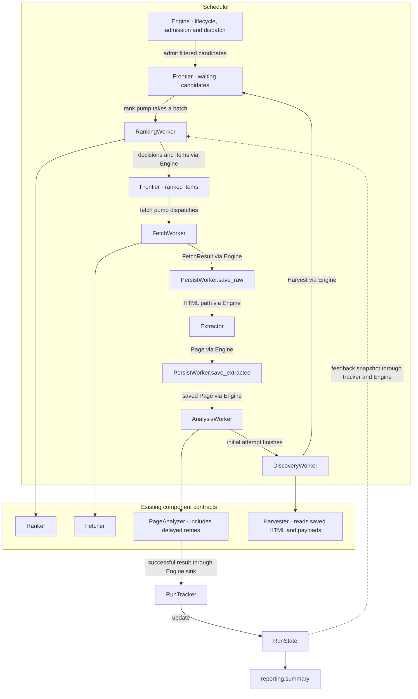

# Engine refactoring plan

Reviewed on 2026-09-15. The worker split and runtime state consolidation are implemented
in this branch. Lifecycle fixes and performance work remain open.

The goal is clearer ownership and less wasted work. Moving code is not evidence of
higher throughput. Measure network, model, parsing and scheduler time separately.

## Current structure

```text
src/crawlme/
  scheduler/
    engine.py          Lifecycle, dispatch, admission, outcomes and checkpoints
    factory.py         Construct and inject concrete workers
    reporting.py       Read RunState and build the CLI report
    stop_conds.py      Decide run stopping and source retirement
    workers/
      ranking.py       Rank candidates and produce frontier items
      fetch.py         Fetch responses and enforce robots policy
      persist.py       Coordinate page file writes and database queuing
      analysis.py      Bound initial analysis and recheck the result target
      discovery.py     Harvest saved page inputs with a bounded wait
  runtime/
    state.py           RunState and its page, source and statistics types
    tracking.py        RunTracker updates and ranking feedback snapshots
    events.py          Persist crawl events
  storage/
    base.py            Storage protocol for run records and fetched files
    sqlite.py          SqliteStorage implementation
```

The earlier `PageWorker`, `CandidateCoordinator` and `RunProgress` proposals are
superseded. Workers have different inputs and outputs. There is no common Worker
Protocol, generic pipeline or automatic stage discovery. The factory assembles
workers; Engine coordinates them.



Most discovered candidates are ranked before fetching, extraction and analysis.
Initial seeds and listing continuations retain their direct admission rules.
Harvester reads saved inputs, not analyzer output. A failed initial analysis can
retry later while discovery proceeds.

## Ownership and invariants

| Owner | Responsibility |
|---|---|
| Engine | Run control state, pump and page task handles, backpressure, candidate admission, queue mutations, checkpoint timing |
| Frontier | Waiting, scored and cooling work, deduplication, ranking-in-progress count and snapshots |
| RunState | Limits, progress, reporting statistics, page/source associations, feedback and seed enhancement metadata |
| RunTracker | Synchronous updates and joins over one RunState; no separate copy of run data |
| TokenBudget | Token accounting and stage usage; callback updates the progress mirror |
| PageAnalyzer | Analysis execution, delayed retry queue and result sink |
| Workers | Stage execution through existing component contracts |
| Reporting | Read RunState without mutating it |

Workers do not receive Engine or the entire mutable RunState. Tracking does not
perform network calls or mutate Frontier. Engine applies source retirement decisions.
These are event-loop ownership boundaries, not a thread-safety guarantee.

`RunState` keeps `Limits`, `Progress` and `Stats` distinct by their readers.
Stopping policies receive limits and progress, not reporting statistics.
`Stats` remains in `runtime/state.py` because it is small; it may be split out
when its responsibilities grow.

Startup reset preserves RunState identity, prepared seed URLs, enhancement metadata
and pre-run token usage. It clears execution history and counters. Resume does not
reset it. Code must not retain references to nested objects replaced by reset.

There is no PageContext container. The page path uses `FrontierItem`,
`FetchedPage`, `Page` and `Harvest`. Delayed results join page records by identity.
The `page_contexts` mapping stores ranking feedback; it is not a pipeline envelope.

FetchWorker returns `FetchResult` or a typed `FetchFailure`. Engine records page
ownership and publication information before analysis. AnalysisWorker checks the
result target after acquiring its slot. Engine bounds fetching, extraction and
persistence together with page slots. Page slots do not cover analysis, and
analysis slots do not cover harvesting.

Engine calls PersistWorker twice: `save_raw` before invoking Extractor, then
`save_extracted` before analysis. PersistWorker handles file-write threads, partial
payload failures and attaching paths before queuing the Page. Storage owns paths
and the underlying writes. FetchWorker never calls PersistWorker or Extractor;
its remaining Storage dependency is for the existing robots cache.

All successful analysis results, including retries, use the Engine sink for storage,
tracking and retirement. PageBook prevents duplicate source votes. This does not
make every analysis counter idempotent under arbitrary duplicate delivery.

Keep page associations while ranking or delayed analysis can still need them.
Consolidating their ownership does not bound their memory growth.

## Confirmed failure and current limits

On 2026-09-14, run `20260914_162309` exposed the pump supervision defect.

- LiteLLM initialization completed in 1.4 seconds.
- Goal and seed enhancement exceeded the new 90-second request deadline.
- Ranking exceeded the deadline at 16:29:20. The exception escapes the rank pump.
- Engine waits for both pumps with `gather(return_exceptions=True)` before
  inspecting failures. The fetch pump therefore keeps running.
- With no fetchable items and 149 buffered candidates, it repeatedly tries to wake
  ranking. The log contains 3,921 `fetch_pump.waking_rank` entries.

The log and control flow support this failure chain. They do not establish whether
the model request stalled at the provider, network or client transport layer.
The timestamps alone also do not establish continuous execution throughout the run.

The current LLM client passes a 90-second timeout to LiteLLM. It does not impose an
outer deadline or fix pump supervision. A transient timeout can still trigger the
client's retry policy.

Other limits remain:

- Fetch dispatch polls at 0.2-second intervals and directly wakes the waiting buffer.
- Normal scheduler shutdown closes analysis without first draining delayed retries.
- Pause does not explicitly await both pumps before writing its checkpoint.
- Periodic snapshots represent Frontier, not all page tasks, source history or retries.
- Same-host robots loads are not coalesced.
- Candidate admission is performed one candidate at a time; rank result mapping
  includes repeated linear searches.

## Remaining lifecycle design

A pump failure must be observed immediately. Record the exception, stop dispatch,
wake or stop the other pump, and settle page tasks within one shutdown deadline.
Do not wait for both pumps to finish before reporting the first failure.

Inspect unexpected page-task exceptions as well. Expected per-page failures retain
their existing storage behavior. Release ranking and in-flight counts in `finally`.
TaskGroup is an implementation option, not permission to cancel pending writes
without a defined shutdown policy.

The following behavior is proposed, not implemented:

| Exit condition | New work | In-flight work and analysis retries |
|---|---|---|
| Frontier exhausted | Stop dispatch | Drain retries within remaining budgets and a shutdown deadline |
| Result target or token/time limit | Stop the affected work | Accept returned results; do not start calls beyond the limit |
| Page limit | Stop fetching | Allow analysis of fetched pages within remaining analysis budgets |
| User stop or fatal error | Stop dispatch and wake waiters | Bounded settlement, cancel queued retries, report unfinished work |
| Pause | Freeze fetching and ranking | Reach a stable checkpoint boundary; retain queued retries in memory |
| Resume | Restore scheduling | Resume retained work without duplicate pumps or retry workers |

Add narrow Analyzer lifecycle methods where needed; do not manipulate its private
retry queue from Engine. In-memory pause/resume and process-restart recovery are
separate capabilities. Historical database migration and lossless cross-process
recovery are outside this refactor.

Pause snapshots must follow completion or restoration of in-flight ranking batches.
Use storage queue ordering or an explicit flush barrier for persistence, not sleeps.

## Performance work and evidence

| Change | Preserve | Measure before retaining |
|---|---|---|
| Batch candidate admission | Ordering, capacity eviction, deduplication, retirement and counter definitions | Lock/notification count, admission time, source coverage, rank calls and input tokens |
| Batch candidate index | Duplicate-ID and missing-decision behavior | Mapping CPU time at realistic batch sizes |
| Shared same-host robots load | Existing cache/TTL and failure policy | Cold-cache request count and cancellation behavior |
| Event-driven scheduling | Budget, cooldown and batch deadlines | Ready-to-dispatch latency and idle wakeups |
| Parsing executor or bounded stage queues | Parser safety and bounded memory | Queue time, lock wait, stage utilization and backlog |
| Checkpoint/storage changes | Snapshot consistency and write order | Event-loop delay, serialization time and writer backlog |

Coalesce robots requests by hostname, not registrable domain. Cancelling one waiter
must not cancel a shared load needed by others. Clear failed loads and settle shared
tasks at shutdown.

Replacing polling requires notifications for ranked work, candidate readiness,
completed page tasks, budget changes, stop and pause. Timers must also cover domain
cooldowns, maximum batch wait and the run deadline. Use a Condition or versioned
notification to avoid lost wakeups; always recheck the condition.

Keep `LXML_LOCK`. Cancelling a parsing await does not stop its thread. Do not add
threads, parsers or writers until measurements identify the bottleneck.

## Validation

Use fixed inputs and stub responses keyed by candidate/page identity. Compare exact
outputs in a serial run before checking permitted concurrent interleavings.

| Scenario | Required checks |
|---|---|
| Ordinary link graph | Deduplication, depth/domain boundaries, budgets and output equivalence |
| Platform listings | Short or missing captions, listings versus posts, pagination and source fairness |
| High candidate volume | Capacity boundaries, admission time, memory and event-loop delay |
| Slow or failed stages | Backpressure, exception propagation, bounded shutdown and retry settlement |
| No LLM | Existing filtering and neutral-priority behavior |
| State joins | Analysis before/after listing discovery, one vote, reset and shared state identity |
| Pump supervision | Run both pumps, fail either one and assert bounded exit and visible failure |
| Pause/resume | In-flight ranking, stable snapshots, repeated resume and retry ownership |
| Notifications | Early notification, spurious wakeups, cooldown-only and deadline-only wakeups |
| Robots | Same-host sharing, independent hosts, failed loads and waiter cancellation |

Calling `_note_pump_failures()` directly is not a pump supervision test.

For performance comparisons, fix configuration, inputs, clock policy and environment.
Warm up and repeat at least five times; report median and range. Record throughput,
first relevant result, stage waits, peak in-flight work, memory, storage backlog,
request/token counts and per-source coverage. A live platform run supplements these
checks but cannot isolate a local optimization.

After rebasing onto master, the structural refactor passed 918 tests, with 1 skipped
and 6 deselected, plus Ruff, formatting, mypy and four dashboard tests. These checks
do not validate the remaining lifecycle work or establish a performance improvement.

Keep structural changes, lifecycle changes and performance changes independently
reviewable. Do not maintain two engines or add migration-only user flags.

Moving discovery before analysis, adding rank pumps, redesigning Frontier aging,
building a generic pipeline and expanding platform support remain separate decisions.
See [arch.md](arch.md) for the implemented architecture.
