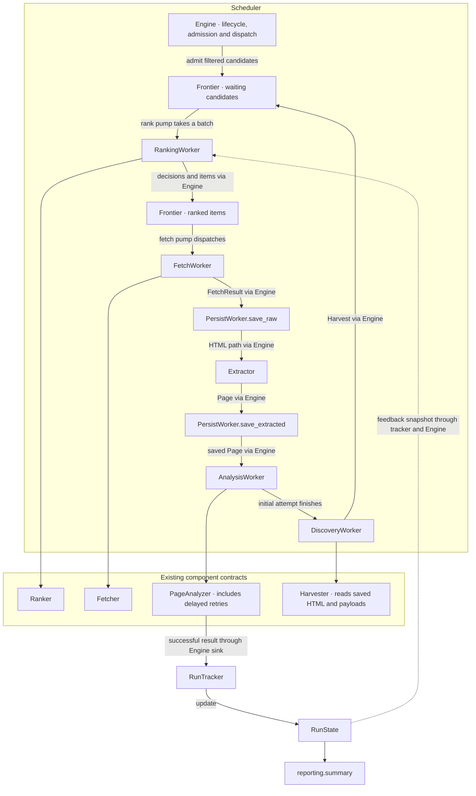

# Engine refactoring status

Reviewed against the code on 2026-10-06. The worker split, runtime state consolidation,
analysis retry settlement, pump supervision and in-memory pause/resume are implemented.
Performance work remains open. Measurements below retain their original dates.

The goal is clearer ownership and less wasted work. Moving code is not evidence of
higher throughput. Measure network, model, parsing and scheduler time separately.

Queue aging now uses a time-independent heap key. All waiting items gain the same
linear time term, so ordering by base priority minus enqueue time times the aging
rate gives the same result as comparing their current effective scores. Cooled-down
items rejoin before selection, and restored queues rebuild the same keys.

## Current structure

```text
src/crawlme/
  scheduler/
    engine.py          Lifecycle, dispatch, admission, outcomes and checkpoints
    factory.py         Construct and inject concrete workers
    reporting.py       Read RunState and build the CLI report
    stop_conds.py      Decide run stopping and source retirement
    workers/
      ranking.py       Rank candidates and produce frontier items
      fetch.py         Fetch responses and enforce robots policy
      persist.py       Coordinate page file writes and database queuing
      analysis.py      Bound initial analysis and recheck the result target
      discovery.py     Harvest saved page inputs with a bounded wait
  runtime/
    state.py           RunState and its page, source and statistics types
    tracking.py        RunTracker updates and ranking feedback snapshots
    events.py          Persist crawl events
  storage/
    base.py            Storage protocol for run records and fetched files
    sqlite.py          SqliteStorage implementation
    read.py            Read-only connections and stored result loading
    queries.py         Shared result queries and dedup input mapping
```

The earlier `PageWorker`, `CandidateCoordinator` and `RunProgress` proposals are
superseded. Workers have different inputs and outputs. There is no common Worker
Protocol, generic pipeline or automatic stage discovery. The factory assembles
workers, and Engine coordinates them.


```mermaid
flowchart TB
    subgraph scheduler["Scheduler"]
        engine["Engine · lifecycle, admission and dispatch"]
        buffer["Frontier · waiting candidates"]
        queue["Frontier · ranked items"]
        engine -->|admit filtered candidates| buffer
        buffer -->|rank pump takes a batch| rank["RankingWorker"]
        rank -->|decisions and items via Engine| queue
        queue -->|fetch pump dispatches| fetch["FetchWorker"]
        fetch -->|FetchResult via Engine| raw["PersistWorker.save_raw"]
        raw -->|HTML path via Engine| extract["Extractor"]
        extract -->|Page via Engine| saved["PersistWorker.save_extracted"]
        saved -->|saved Page via Engine| analysis["AnalysisWorker"]
        analysis -->|initial attempt finishes| discovery["DiscoveryWorker"]
        discovery -->|Harvest via Engine| buffer
    end
    subgraph components["Existing component contracts"]
        ranker["Ranker"]
        fetcher["Fetcher"]
        analyzer["PageAnalyzer · includes delayed retries"]
        harvester["Harvester · reads saved HTML and payloads"]
    end
    rank --> ranker
    fetch --> fetcher
    analysis --> analyzer
    discovery --> harvester
    analyzer -->|successful result through Engine sink| tracker["RunTracker"]
    tracker -->|update| state["RunState"]
    state -. feedback snapshot through tracker and Engine .-> rank
    state --> reporting["reporting.summary"]
```

Most discovered candidates are ranked before fetching, extraction and analysis.
Initial seeds and listing continuations retain their direct admission rules.
Harvester reads saved inputs, not analyzer output. A failed initial analysis can
retry later while discovery proceeds.

## Ownership and invariants

| Owner | Responsibility |
|---|---|
| Engine | Run control state, pump and page task handles, backpressure, candidate admission, queue mutations, checkpoint timing |
| Frontier | Waiting, scored and cooling work, deduplication, ranking-in-progress count and snapshots |
| RunState | Limits, progress, reporting statistics, page/source associations, feedback and seed expansion metadata |
| RunTracker | Synchronous updates and joins over one RunState |
| TokenBudget | Token accounting and stage usage, with a callback updating the progress mirror |
| PageAnalyzer | Analysis execution, delayed retry queue and result sink |
| Workers | Stage execution through existing component contracts |
| Reporting | Read RunState without mutating it |

Workers do not receive Engine or the entire mutable RunState. Tracking does not
perform network calls or mutate Frontier. Engine applies source retirement decisions.
These are event-loop ownership boundaries, not a thread-safety guarantee.

`RunState` keeps `Limits`, `Progress` and `Stats` distinct by their readers.
Stopping policies receive limits and progress, not reporting statistics.
`Stats` remains in `runtime/state.py`.

Startup reset preserves RunState identity, prepared seed URLs, expansion metadata
and pre-run token usage. It clears execution history and counters. Resume does not
reset it. Code must not retain references to nested objects replaced by reset.

There is no PageContext container. The page path uses `FrontierItem`,
`FetchedPage`, `Page` and `Harvest`. Delayed results join page records by identity.
The `page_contexts` mapping stores ranking feedback.

FetchWorker returns `FetchResult` or a typed `FetchFailure`. Engine records page
ownership and publication information before analysis. AnalysisWorker checks the
result target after acquiring its slot. Engine bounds fetching, extraction and
persistence together with page slots. Page slots do not cover analysis, and
analysis slots do not cover harvesting.

Engine calls PersistWorker twice: `save_raw` before invoking Extractor, then
`save_extracted` before analysis. PersistWorker handles file-write threads, partial
payload failures and attaching paths before queuing the Page. Storage owns paths
and the underlying writes. FetchWorker uses Storage for the robots cache. It does
not call PersistWorker or Extractor.

Seed verification receives a `SeedProbe` assembled by the factory from the same
fetch, persistence and discovery workers. The probe enforces robots and cooldown
policies, saves HTML and payloads, and discovers candidates without writing an
unextracted Page row. Each verification attempt has a 60-second deadline.

All successful analysis results, including retries, use the Engine sink for storage,
tracking and retirement. PageBook prevents duplicate source votes. This does not
make every analysis counter idempotent under arbitrary duplicate delivery.

Page associations and contexts now retain only keys owned by active page tasks,
queued or active analysis retries, and waiting or active ranking batches. The
80-page chain regression previously accumulated 80 page records; it now asserts
at most two live records and contexts, and none after completion. This is a
retention check, not a throughput or process-memory benchmark.

Frontier snapshots include ranking candidates and retired sources. Restoring moves
interrupted ranking back to waiting, filters visited/queued/retired candidates and
clears prior buffer state even when the snapshot is empty. Outcome recording charges
budgets once per URL. Queue snapshots serialize live items, and lazy heap entries
are identified by sequence as well as URL; excess stale entries are compacted.

The buffer's seen keys remain admission history, Frontier visited keys remain
settled outcomes, and queue membership covers waiting, cooling and in-flight URLs.
These sets serve different purposes. Exact URL history still grows with distinct
URLs; this change does not claim constant total memory or lossless crash recovery.

## Confirmed failure and current limits

On 2026-09-14, run `20260914_162309` exposed the pump supervision defect.

- LiteLLM initialization completed in 1.4 seconds.
- Goal enhancement and seed expansion exceeded the new 90-second request deadline.
- Ranking exceeded the deadline at 16:29:20. The exception escapes the rank pump.
- Engine waited for both pumps with `gather(return_exceptions=True)` before
  inspecting failures. The fetch pump therefore kept running.
- With no fetchable items and 149 buffered candidates, it repeatedly tries to wake
  ranking. The log contains 3,921 `fetch_pump.waking_rank` entries.

The log and control flow support this failure chain. They do not establish whether
the model request stalled at the provider, network or client transport layer.
The timestamps alone also do not establish continuous execution throughout the run.

The current LLM client passes a 90-second timeout to LiteLLM. A transient timeout
can still trigger the client's retry policy. Engine now observes the first pump
failure, cancels its peer and records a FAILED run. Unexpected page-task exceptions
follow the same path. Cleanup attempts every worker even if one close operation fails.

Analysis retries now settle independently of dedup, within run limits and a
shared 120-second deadline for pump, page and retry settlement. Cancellation settles
pages, saves a checkpoint and closes resources before propagating. Pause waits for
both pumps before saving its checkpoint.

Other limits remain:

- Fetch dispatch polls at 0.2-second intervals and signals `Frontier.wake_ranker`.
  Frontier owns batch readiness and keeps its buffer private.
- Periodic snapshots represent Frontier, not all page tasks, source history or retries.
- Same-host robots loads are not coalesced.
- Candidate admission is performed one candidate at a time. Rank result mapping
  includes repeated linear searches.

## Remaining lifecycle design

Failure supervision is implemented. Expected per-page fetch failures retain their
existing storage behavior. Ranking and in-flight counts are released in `finally`.

The table describes the implemented lifecycle. The original run task owns every
pause/resume cycle; concurrent control requests are serialized.

| Exit condition | New work | In-flight work and analysis retries |
|---|---|---|
| Frontier exhausted | Stop dispatch | Drain retries within remaining budgets and a shutdown deadline |
| Result target or token/time limit | Stop the affected work | Accept returned results without starting calls beyond the limit |
| Page limit | Stop fetching | Allow analysis of fetched pages within remaining analysis budgets |
| User stop or fatal error | Stop dispatch and wake waiters | Bounded settlement, cancel queued retries, report unfinished work |
| Pause | Freeze fetching and ranking | Reach a stable checkpoint boundary and retain queued retries in memory |
| Resume | Restore scheduling | Resume retained work without duplicate pumps or retry workers |

Expose any further Analyzer lifecycle operations through methods that keep retry
queue ownership inside Analyzer. In-memory pause/resume and process-restart recovery are
separate capabilities. Historical database migration and lossless cross-process
recovery are outside this refactor.

Pause snapshots follow completion or restoration of in-flight ranking batches and
a storage flush barrier. Interrupted batches return ahead of newer candidates; this
can temporarily exceed buffer capacity by one ranking batch. Analysis retries stay
in memory and do not run while paused. Resume preserves the original start time,
so paused time counts toward the wall-clock limit.

## Performance work and evidence

| Change | Preserve | Measure before retaining |
|---|---|---|
| Batch candidate admission | Ordering, capacity eviction, deduplication, retirement and counter definitions | Lock/notification count, admission time, source coverage, rank calls and input tokens |
| Batch candidate index | Duplicate-ID and missing-decision behavior | Mapping CPU time at realistic batch sizes |
| Shared same-host robots load | Existing cache/TTL and failure policy | Cold-cache request count and cancellation behavior |
| Event-driven scheduling | Budget, cooldown and batch deadlines | Ready-to-dispatch latency and idle wakeups |
| Parsing executor or bounded stage queues | Parser safety and bounded memory | Queue time, lock wait, stage utilization and backlog |
| Checkpoint/storage changes | Snapshot consistency and write order | Event-loop delay, serialization time and writer backlog |

Coalesce robots requests by hostname, not registrable domain. Cancelling one waiter
must not cancel a shared load needed by others. Clear failed loads and settle shared
tasks at shutdown.

Replacing polling requires notifications for ranked work, candidate readiness,
completed page tasks, budget changes, stop and pause. Timers must also cover domain
cooldowns, maximum batch wait and the run deadline. Use a Condition or versioned
notification to avoid lost wakeups, and recheck the condition after waking.

Keep `LXML_LOCK`. Cancelling a parsing await does not stop its thread. Do not add
threads, parsers or writers until measurements identify the bottleneck.

## Validation

Use fixed inputs and stub responses keyed by candidate/page identity. Compare exact
outputs in a serial run before checking permitted concurrent interleavings.

| Scenario | Required checks |
|---|---|
| Ordinary link graph | Deduplication, depth/domain boundaries, budgets and output equivalence |
| Platform listings | Short or missing captions, listings versus posts, pagination and source fairness |
| High candidate volume | Capacity boundaries, admission time, memory and event-loop delay |
| Slow or failed stages | Backpressure, exception propagation, bounded shutdown and retry settlement |
| No LLM | Existing filtering and neutral-priority behavior |
| State joins | Analysis before/after listing discovery, one vote, reset and shared state identity |
| Pump supervision | Run both pumps, fail either one and assert bounded exit and visible failure |
| Pause/resume | In-flight ranking, stable snapshots, repeated resume and retry ownership |
| Notifications | Early notification, spurious wakeups, cooldown-only and deadline-only wakeups |
| Robots | Same-host sharing, independent hosts, failed loads and waiter cancellation |

Calling `_note_pump_failures()` directly is not a pump supervision test.

For performance comparisons, fix configuration, inputs, clock policy and environment.
Warm up and repeat at least five times, reporting median and range. Record throughput,
first relevant result, stage waits, peak in-flight work, memory, storage backlog,
request/token counts and per-source coverage. A live platform run supplements these
checks but cannot isolate a local optimization.

The 2026-09-15 review recorded 918 passing tests after rebasing onto master, with 1 skipped
and 6 deselected, plus Ruff, formatting, mypy and four dashboard tests. These checks
do not validate the remaining lifecycle work or establish a performance improvement.

Keep structural changes, lifecycle changes and performance changes independently
reviewable. Do not maintain two engines or add migration-only user flags.

Moving discovery before analysis, adding rank pumps, redesigning Frontier aging,
building a generic pipeline and expanding platform support remain separate decisions.
See [arch.md](arch.md) for the implemented architecture.
